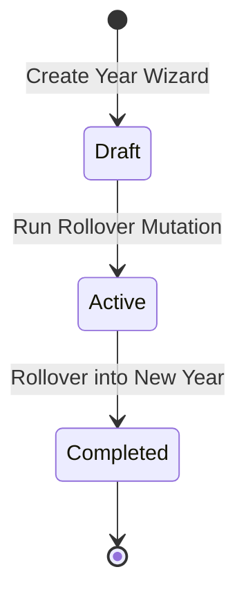

# Frontend-to-Backend Handoff: Academic Year Setup & Rollover Module

This document outlines the frontend data structures, form inputs, required API operations, and business logic for the **Academic Year Setup & Rollover** module. It serves as a specification for the backend team to build the necessary database tables, queries, mutations, and background migration scripts.

---

## 1. Frontend Data Models & Expected Fields

The Academic Setup module coordinates the overall institutional cycle of the school. The frontend captures these configurations through a 3-step setup wizard and displays active/draft/completed years in a dashboard grid.

### 1.1 Academic Year (Master Cycle)

Represents an overall annual session. The frontend expects each academic year object to contain the following fields:

* **`id`**: Unique identifier (UUID).
* **`name`**: The display label of the cycle (e.g., `"Academic Year 2024 - 2025"`).
* **`startDate`**: The official start date of the academic year (ISO 8601 Date string, e.g. `"2024-06-01"`).
* **`endDate`**: The official end date of the academic year (ISO 8601 Date string, e.g. `"2025-05-31"`).
* **`status`**: The operational state of the cycle. Must be exactly one of:
  * `"Active"`: The current ongoing year. Only one year can be active at a time.
  * `"Draft"`: A future year configuration that has been created but not yet rolled over or activated.
  * `"Completed"`: A historical year.
* **`termsCount`**: A calculated integer representing the number of terms mapped to this academic year.

#### Calendar Form Inputs (Step 1)
When defining the calendar in the wizard, the frontend captures:
* **Academic Year Label**: Text input. If empty, it is auto-populated based on the start date (e.g. `"Academic Year 2025 - 2026"` when starting in 2025).
* **Academic Start Date**: Calendar picker.
* **Academic End Date**: Calendar picker. Defaults to May 31st of the following calendar year when the start date is selected.

---

### 1.2 Academic Term (Sub-Entity)

Represents chronological grading/calendar periods (e.g., Semesters or Terms) within the parent academic year. The frontend expects:

* **`id`**: Unique term identifier (UUID).
* **`academicYearId`**: Foreign key pointing to the parent Academic Year.
* **`name`**: Display name of the term (e.g., `"Term 1"`, `"Term 2"`, `"Semester 1"`).
* **`startDate`**: Start date of the term (ISO 8601 Date string).
* **`endDate`**: End date of the term (ISO 8601 Date string).

#### Term Form Inputs (Step 2)
When configuring terms, the user can dynamically add or remove terms in a list. For each term, the frontend captures:
* **Term Name**: Text input.
* **Starts**: Calendar picker for term start date.
* **Ends**: Calendar picker for term end date.

---

### 1.3 Data Rollover Settings (Action Parameters)

During the final step of the setup wizard, the admin chooses parameters that dictate how data migrates from the currently `"Active"` year to the new academic year. The frontend captures these toggles as boolean flags:

* **`students` (Carry Over Students)**: Promote active students to the next grade (e.g. promoting Grade 9 students to Grade 10).
* **`teachers` (Maintain Staff Records)**: Clone teacher profiles, department associations, and teacher-grade specializations.
* **`subjects` (Clone Subject Master)**: Clone active subjects and subject-grade default templates.
* **`timetable` (Clone Timetable)**: Copy global scheduler settings, daily rhythms (period counts/durations), breaks, and weekly timetable slot templates.
* **`auraPoints` (Reset Metrics)**: Clear student-accumulated aura points back to `0` or initial baseline values for the new year.

---

## 2. Required Client-Server Operations

Currently, the schema lacks queries and mutations to support this module. The backend API must expose endpoints/resolvers to support the following operations:

### 2.1 Queries

1. **`academicYears`**: 
   * Retrieves all academic year cycles scoped to the authenticated user's `schoolId`.
   * **Sort Order**: Sorted chronologically by `startDate` (newest first).
2. **`academicYear(id: ID!)`**: 
   * Retrieves details of a specific academic year including its nested `terms` array.
3. **`activeAcademicYear`**: 
   * Retrieves the currently `"Active"` academic year for the school. This is critical for scoping dashboards, grade entries, and attendance logs.

### 2.2 Mutations

1. **`saveAcademicYearDraft(input: SaveAcademicYearInput!)`**:
   * Creates or updates an academic year and its nested terms in `"Draft"` status.
   * Allows the admin to save progress on a future year calendar mapping without initiating any database rollover.
2. **`deleteAcademicYearDraft(id: ID!)`**:
   * Deletes a draft academic year.
   * **Constraint**: Only allowed if status is `"Draft"`. Rejects deletion of `"Active"` or `"Completed"` cycles.
3. **`initiateAcademicYearRollover(id: ID!, options: RolloverOptionsInput!)`**:
   * Performs the transition of the school state to the target academic year.
   * **Payload parameters**: Target academic year ID and the set of rollover parameters (boolean flags for students, teachers, subjects, timetable, and metrics reset).
   * Triggers the backend migration job (see Business Logic below).

---

## 3. Business Logic & Validation Constraints

The backend must enforce several strict rules to maintain data integrity across institutional years.

### 3.1 Status Transitions & Singleton "Active" Rule

* **State Machine**: An Academic Year transitions from:
  `Draft` &rarr; `Active` &rarr; `Completed`
* **Active Status Limit**: There must be **exactly one** `"Active"` academic year record per school at any point.
* **Transition Trigger**: When the `initiateAcademicYearRollover` mutation completes successfully:
  1. The previously `"Active"` academic year must be updated to `"Completed"`.
  2. The target academic year (which was in `"Draft"`) must be updated to `"Active"`.
  3. The current academic year state across the system updates to this new cycle.

### 3.2 Date Validity Constraints

When saving or updating calendars and terms, the backend must validate:
1. **Year Boundaries**: The academic year `startDate` must be earlier than its `endDate`.
2. **Term Boundaries**: Each term's `startDate` and `endDate` must lie completely within the parent year's `startDate` and `endDate` bounds.
3. **Term Order**: Terms must be chronological and non-overlapping.
   * For terms sorted by index $i$: $\text{Term}_{i}.\text{startDate} \ge \text{Term}_{i-1}.\text{endDate}$.

---

### 3.3 Data Migration Rollover Logic

The rollover process alters core application tables. Depending on the toggles selected:

* **Carry Over Students (`students` = true)**:
  * The backend must migrate students to their next grade level.
  * If a student was in the highest grade (e.g. Grade 12), they should be marked as `"Graduated"` or `"Inactive"` (not promoted).
  * If `students` is false, students' class assignments are cleared, and they must be manually placed in classes for the new year.
* **Maintain Staff Records (`teachers` = true)**:
  * Teacher accounts remain active. Their core specialization credentials are carried forward.
* **Clone Subject Master (`subjects` = true)**:
  * Copies active catalog subjects to the new year scope.
  * Clones the default grade templates (e.g. Grade 10 teaches Math, Physics, Chemistry) into the new year scope.
* **Clone Timetable (`timetable` = true)**:
  * Copies the global scheduler configuration (school start time, default session duration, active days).
  * Clones the list of recurrent school breaks (e.g. Short Break, Lunch Break).
  * Clones the structural layout of weekly timetable slot entries (without teacher assignments, unless `teachers` is also true and mappings match).
* **Reset Metrics (`auraPoints` = true)**:
  * Resets the `auraPoints` accumulator for all students to `0` or baseline.
  * Keeps historical aura logs in archives, but active profile points reset.

---

### 3.4 Multi-Tenant Scoping

* **Tenant Isolation**: All operations (queries and mutations) must accept and validate a `schoolId`. It is impossible to query or modify academic years across schools.
* **Year Scope**: The database schema must scope yearly mappings (like Curriculum Mappings, Weekly Timetables, and Examinations) by both `schoolId` and `academicYearId`. This prevents query conflicts when retrieving historic terms or exams.
