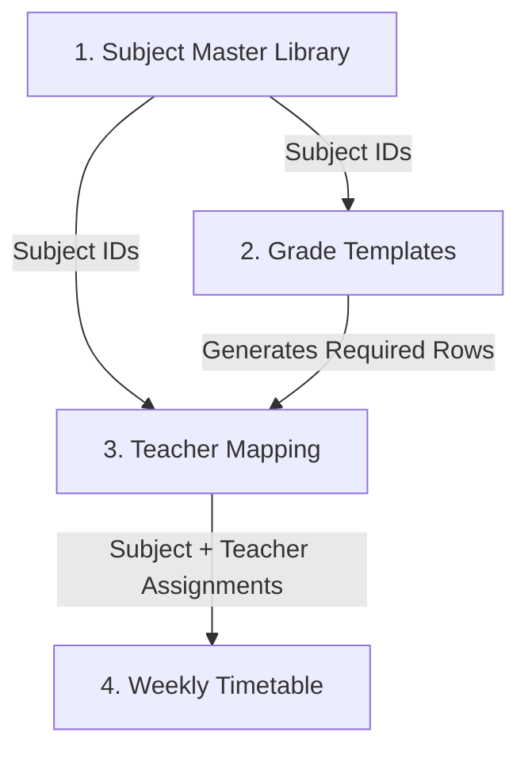

# Frontend-to-Backend Handoff: Curriculum & Timetable Module

This document specifies the frontend data models, input forms, user actions, and business rules of the **Curriculum Mapping & Timetable Scheduler** module. It serves as a guide for the backend team to align their database entities and API designs with the frontend's functional requirements.

---

## 1. Frontend Data Models & Expected Fields

The following subsections describe the exact fields the frontend expects when loading data, and the values it captures in its dialogs and forms.

### 1.1 Subjects (Subject Catalog)

Managed under the "Subject Master" tab. The frontend expects each subject object to have these fields:

* **`id`**: Unique identifier (UUID).
* **`name`**: The display name of the subject (e.g., `"Mathematics"`, `"Physics"`).
* **`code`**: Course catalog code (e.g., `"MAT101"`, `"PHY101"`).
* **`category`**: Classifications: `"Core"`, `"Elective"`, `"Language"`, or `"Co-Scholastic"`.
* **`department`** (or specialization): Subject discipline area: `"Mathematics"`, `"Science"`, `"Humanities"`, `"Languages"`, `"Arts"`, `"Technology"`, `"Administration"`, or `"Sports"`.

#### Subject Form Inputs

When creating or editing a subject, the frontend collects:

* Subject Name (string)
* Subject Code (string)
* Subject Area / Department (selection dropdown)
* Category Type (selection dropdown)

---

### 1.2 Grade Configuration Templates (Grade Settings)

Managed under the "Grade Templates" tab. Default configurations applied at the Grade level (e.g., "Grade 10" by default teaches Math, Physics, and English, whereas "Grade 1" might only teach Languages).

The frontend expects each grade config template to have these fields:

* **`grade`**: Grade name matching the class roster grades (e.g., `"Grade 10"`, `"Grade 1"`).
* **`subjects`**: Array of Subject IDs representing default courses taught in this grade.
* **`periodsPerDay`**: Default count of periods in a day (e.g., `8`).
* **`periodDurationMinutes`**: Default length of a period in minutes (e.g., `60`).
* **`teachingHoursPerWeek`**: Expected weekly hours threshold (e.g., `35`).

#### Grade Template Form Inputs

When setting or editing defaults for a grade level, the frontend collects:

* Target Grade Level (dropdown)
* Selected subjects checklist (checks/unchecks Subject IDs categorized by type)

---

### 1.3 Academic Tiers (Grade Groups)

Organizes grades into custom bands (e.g., "Middle School" contains Grades 5-8, "High School" containing Grades 9-12).

The frontend expects:

* **`id`**: Unique group identifier.
* **`label`**: E.g., `"Middle School"`, `"High School"`.
* **`grades`**: List of grade names assigned to this tier, e.g., `["Grade 5", "Grade 6"]`.

#### Tier Configuration Inputs

When organizing academic tiers, the frontend collects:

* Tier Name/Label (input text)
* Add/Remove grades associated with the tier

---

### 1.4 Teacher Assignment Mappings

Managed under the "Teacher Mapping" tab. Associates a specific teacher with a subject for a class section (e.g., "Grade 10-A, Physics" is taught by "Mr. Marcus Roberts").

The frontend expects each mapping object to have these fields:

* **`id`**: Unique mapping identifier.
* **`grade`**: E.g. `"Grade 10"`.
* **`section`**: E.g. `"A"`.
* **`subjectId`**: UUID of the mapped subject.
* **`teacherId`**: UUID of the assigned teacher.
* **`hoursPerWeek`**: Weekly allocated hours (default `4`).
* **`isAdditional`**: `true` if the subject is an ad-hoc custom addition to this section (not defined in the default Grade template).

#### Teacher Mapping Form Inputs

When mapping a teacher, the frontend collects:

* Target Grade (select) & Section (text)
* Target Subject (select)
* Assigned Teacher (select)
* Custom check indicator (marking if it is an additional/custom mapping)

---

### 1.5 Timetable Entries (Weekly Grid Slots)

Managed under the "Weekly Timetable" tab. Represents individual cells scheduled in the grid.

The frontend expects scheduled slots to contain:

* **`day`**: Weekday name (e.g. `"Monday"`, `"Friday"`).
* **`period`**: 1-based period index slot (e.g. `1` for Period 1, `2` for Period 2).
* **`subjectId`** & **`subjectName`**: Mapped subject details.
* **`teacherId`** & **`teacherName`**: Assigned teacher details.
* **`spanPeriods`**: Horizontal/vertical slots span index (default `1` if single period, `2` if double period).

---

### 1.6 Global Scheduler Rhythms & Breaks

Defines the structure, breaks, and daily timing of the school scheduler.

The frontend manages schedule configs with these options:

* **School Start Time**: Starting daily hour, e.g., `"08:30"`.
* **Duration Type**: `"Uniform"` (all periods same length) or `"Variable"` (individual period overrides).
* **Default Session Duration**: Default duration in minutes (e.g., `60`).
* **Active Days**: Weekdays that are operational (e.g., `["Monday", "Tuesday", "Wednesday", "Thursday", "Friday"]`).
* **Period Length Overrides**: An index mapping custom durations to periods, e.g. Period 1 is 60m, Period 2 is 45m.
* **Day Overrides**: Custom period durations specified for a particular day (e.g. Friday periods are shorter).
* **Breaks & Gaps**: List of scheduled recess periods. Each break has:
  * ID (unique identifier)
  * Label (e.g. `"Short Break"`, `"Lunch Break"`)
  * Type (`"short"`, `"lunch"`, `"other"`)
  * Placement (`"before"` or `"after"` a target period)
  * Target Period (period index index, e.g. `Period 2`)
  * Length (duration in minutes)
  * Applied Days (specific days it applies to, e.g. Friday only; empty means all active days)

---

## 2. Required Client-Server Operations

To fully back the UI, the API needs to support the following operations:

1. **Subjects Catalog:** Query subjects list, create a subject, edit subject details, and delete subjects.
2. **Grade Configuration Templates:** Query configurations list, save/upsert a template (persisting its assigned subjects), and delete templates.
3. **Academic Tiers:** Save and query custom grade groups.
4. **Teacher Mappings:** Query mappings list, create mapping, edit mapping (assigning a new teacher or changing hours), and remove mappings.
5. **Scheduler Timetable:** Batch save/overwrite weekly grid slots for a selected class section, retrieve grid entries for a selected class section, and save/load the global school schedule config (school start, breaks list, period overrides).

---

## 3. Business Logic & Validation Constraints

The API and database layers should enforce these core constraints:

### 3.1 Teacher Attributes for Scheduling Warnings

To support the frontend warning indicators, the query retrieving teachers (or users with the teacher role) should provide:

* **Teaching Scope**: List of grade levels the teacher is approved to teach (e.g. `["Grade 9", "Grade 10"]`).
* **Specializations**: List of subject IDs the teacher is qualified/trained for.
* **Workload Metadata**: Count of active mappings and current schedule assignments.

### 3.2 Double-Booking Checks

* **Teacher Conflicts:** A teacher must not be scheduled in two different class sections at the same weekday and period slot.
* **Double Periods:** If a slot spans multiple periods (`spanPeriods > 1`), teacher availability must be verified for the entire span (e.g., slot starts at Period 3 with span `2` -> check Period 3 and Period 4).

### 3.3 Overlaps with Break Configurations

* The grid renderer maps slots based on the school start time, period durations, and breaks.
* The API should ensure that scheduled period slots do not clash or overlap with global break schedules (e.g. periods must slide/shift around recesses).

### 3.4 Cascading Changes

* **Subject Deletion:** Deleting a subject from the master library should:
  * Remove it from default grade templates.
  * Delete all related teacher assignments mapping this subject.
  * Clear any corresponding weekly timetable slots.

---

## 4. End-to-End Curriculum Lifecycle & Data Flow

To ensure data integrity, the backend team should understand the sequential lifecycle of how data cascades across the four tabs:

### 4.1 Step 1 to Step 2: Subject Association

* **Flow:** Subjects are created in the catalog. When an admin configures a Grade Template, they select a subset of these subjects.
* **Backend Requirement:** Grade templates must link to Subject IDs. If a subject is deleted from the Master catalog, it must be removed from all Grade Templates.

### 4.2 Step 2 to Step 3: Mapping Hydration (Dynamic Joining)

* **Flow:** The "Teacher Mapping" tab displays a grid of sections (e.g., Grade 10-A). For each section, the UI shows a row for every default subject defined in the "Grade 10" template, plus any custom subjects added directly to that section.
* **Logic:** The backend `CurriculumMapping` table should **only** store active teacher assignments. The frontend does not write empty rows to the database for unassigned template subjects; it calculates them dynamically by taking the grade's template subjects list and comparing it to existing mapping records.
* **Required Alert:** If a subject from the Grade Template does not have an active mapping record, the frontend displays a `"Required"` alert.

### 4.3 Step 3 to Step 4: Timetable Allocation & Sync

* **Flow:** When scheduling the "Weekly Timetable" for a section (e.g. Grade 10-A), the slot selection popover **only** displays the subject-teacher pairs mapped in Step 3.
* **Timetable-Mapping Sync (Gap Warning):** If an administrator changes the teacher assigned to a subject in the Mapping tab (e.g. changing Physics from Mr. Roberts to Ms. Elena), the saved weekly timetable slots must reflect this update automatically.
  * *Backend Design Choice:* Timetable slots should ideally reference the `CurriculumMapping` UUID instead of storing the `teacherId` and `subjectName` statically. This ensures that any teacher swaps in Step 3 propagate immediately to the scheduled timetable in Step 4.

### 4.4 Step 4: Cross-Section Teacher Availability (Double-Booking Checks)

* **Flow:** Timetables are edited section-by-section. However, teachers are a shared resource.
* **Conflict Logic:** When the backend saves or validates a class timetable, it must run a validation check against the `TimetableSlot` table. If the assigned teacher is already scheduled in another section (e.g., Grade 10-B) during the same `dayOfWeek` and `periodIndex` slot, the mutation should return a validation conflict error so the admin is notified of the double-booking.
