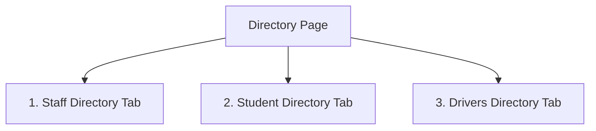
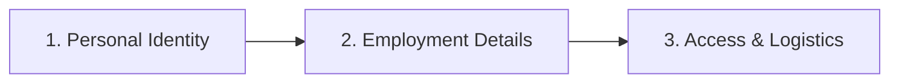

# Frontend Data Requirements: Student & Staff Directory Module

This document outlines the data structures, form inputs, user actions, and user interface filters for the **Student & Staff Directory** module. It serves as a guide for the backend team to align APIs and database structures with the frontend views.

---

## 1. Directory Structure & Navigation

The Directory acts as a unified hub divided into three main role-based tabs.

### 1.1 Action Actions & Filters on the Directory Wrapper
* **Tab Selection**: Toggle tabs to display `"Staff"`, `"Students"`, or `"Drivers"`.
* **Import List**: Triggers the bulk list import dialog (CSV/Excel upload and template download) corresponding to the active role tab.
* **Onboard / Add Button**: Contextual action button that redirects users to role-specific registration pages (`AddStaffPage`, `EnrollStudentPage`, or `AddDriverPage`).

---

## 2. Staff Directory & Onboarding

### 2.1 Staff List Page
Displays employee profiles, designations, and departments.

#### UI Filters
* **Search Bar**: Quick search filtering by staff name, ID, role, or department.
* **Department Filter**: Dropdown selection (e.g. `"Mathematics"`, `"Science"`, `"Languages"`, `"Administration"`, `"Student Affairs"`).
* **Status Filter**: Dropdown selection (e.g. `"Active"`, `"On Leave"`, `"Remote"`, `"Inactive"`).
* **Pagination**: Controls for items per page (default `10`) and current page index.

#### Display Fields (Table Columns & Stats)
* **Stats Cards**: Total Staff headcount, Total Departments count, Average Feedback Score (out of 5.0), and count of Staff On Leave.
* **Staff Member Profile**: Displays avatar image, full name, and employee ID (e.g., `"#ST-1024-001"`).
* **Role / Designation**: E.g. `"Lead Teacher"`, `"Senior Counselor"`.
* **Department**: E.g. `"Mathematics"`, `"Student Affairs"`.
* **Joining Date**: Month and year (e.g. `"12 Oct 2022"`).
* **Feedback Score**: Average rating out of 5.0 (e.g. `4.8`).
* **Status**: Badge indicating `"Active"`, `"On Leave"`, `"Remote"`, or `"Inactive"`.
* **Actions**: Buttons for View Details, Edit Staff, and Delete Staff (opens confirmation modal requiring typing the staff member's name).

---

### 2.2 Onboard Staff Form (AddStaffPage)
A 3-step registration wizard.

* **Step 1: Personal Identity**
  * Profile Photo upload
  * Full Name (text)
  * Date of Birth (date calendar)
  * Gender (chips selection: `"Male"`, `"Female"`, `"Other"`)
  * Blood Group (searchable dropdown: `"A+"`, `"A-"`, etc.)
  * Personal Email & Mobile Number
  * Residential Address (textarea)
* **Step 2: Employment Details**
  * Employee ID (text)
  * Joining Date (date calendar)
  * Subject Area (searchable dropdown: `"Mathematics"`, `"English"`, etc.)
  * Designation & Qualifications (text)
  * Years of Experience (text)
  * Institutional Email & Emergency Contact Number
  * Qualified Grades (checklist chips: `"Grade 1"` to `"Grade 12"`)
  * Subject Specializations (checklist chips: `"Mathematics"`, `"Physics"`, etc.)
* **Step 3: Access & Logistics**
  * Class Teacher For (dropdown class section assignments, e.g. `"Grade 10-A"`)
  * Portal Access Role (dropdown: `"Standard Teacher"`, `"Dept. Head"`, `"Admin"`)
  * Work Shift (dropdown: `"Morning (8:00 - 15:00)"`, `"Noon (11:00 - 18:00)"`)
  * Bus Availed (dropdown: `"No"`, `"Yes - Route A"`, etc.)
  * Biometric Enrollment: Button to link RFID or fingerprint devices.

---

## 3. Student Directory & Enrollment

### 3.1 Student List Page
Displays student demographic info, enrollment timelines, and status alerts.

#### UI Filters
* **Search Bar**: Quick search filtering by name, ID, or grade level.
* **Grade Level Dropdown**: Filter list by specific grade (e.g. `"12th Grade"`, `"11th Grade"`, `"10th Grade"`, `"9th Grade"`).
* **Status Dropdown**: Filter list by status (e.g. `"Active"`, `"At Risk"`, `"Graduated"`, `"Inactive"`).
* **Pagination**: Controls for items per page and current page index.

#### Display Fields (Table Columns & Stats)
* **Stats Cards**: Total Students, Active Programs, Avg Aura Points, and count of Students At Risk.
* **Student Name**: Displays student avatar, full name, and admission ID (e.g. `"#OA-2024-001"`).
* **Grade & Section**: Displays grade level and section (e.g. `"12th Grade"`, `"Sec A"`).
* **Aura Score**: Points accumulated by the student.
* **Joining Date**: Enrollment calendar date (e.g. `"Aug 15, 2021"`).
* **Blood Group**: E.g. `"O+"`.
* **Guardian Info**: Primary guardian name and contact mobile number.
* **Status Alert**: Badge indicating `"Active"`, `"At Risk"`, `"Graduated"`, or `"Inactive"`.
* **Actions**: Buttons for View Profile (redirects to Student Profile Page), Edit Record, and Delete Student (confirmation modal requiring typing student's name).

---

### 3.2 Enroll Student Form (EnrollStudentPage)
A 3-step enrollment wizard.
* **Step 1: Student Identity**
  * Student Photo upload
  * First Name & Last Name (text)
  * Roll Number (text)
  * Date of Birth (date calendar)
  * Gender (chips: `"Male"`, `"Female"`, `"Other"`)
  * Blood Group (searchable dropdown)
  * Aadhaar / National ID (text)
* **Step 2: Family & Guardians**
  * Father Info: Full Name, Mobile, Email, and Occupation.
  * Mother Info: Full Name, Mobile, Email, and Occupation.
  * Emergency Contact / Guardian: Name, Relationship (dropdown), Specify Relationship (if Relationship is `"Other"`), and Contact Mobile Number.
* **Step 3: Academic & Logistics**
  * Admission Grade (searchable dropdown)
  * Academic Session (dropdown, e.g. `"2025-26"`)
  * Admission Number
  * Bus Transportation (searchable dropdown)
  * Residential Address (textarea)

---

### 3.3 Student Profile Details Page (StudentProfilePage)
Displays historical and detailed records for a selected student.

#### Navigation Tabs
The profile details are divided into four tabs:
1. **Overview**:
   * Statistics: Aura Score (progress bar), Attendance %, GPA Index.
   * Participation Intelligence: Percentage breakdown for Attendance Consistency, Assignment Hygiene, Class Engagement, and Activity Density.
   * Highlights Table: Mapped activities (e.g., Varsity Sports, Robotics, Student Council) with role details, icon, and status (`"Active Lead"`, `"Completed"`).
   * Critical Flags: Behavioral alert records containing incident date, comment, and staff notes.
   * Secure Log: Timeline of confidential principal/admin notes.
2. **Academic History**:
   * Longitudinal Performance: Current Session %, Prior Session %, and Annual Avg % scores.
   * Course Material Masteries: Subject-wise progress bars (Mathematics, Physics, History, English).
   * Verification: Download repository action.
3. **Behavioral Records**:
   * Conduct Repository: List of behavioral entries with date, title, commentary text, and staff signature.
   * Security Log: Details of last behavioral audit date and editor name.
4. **Parental Contact**:
   * Father and Mother detail cards showing phone numbers with direct call action links.
   * Secure Link Summary: Bridge meeting log notes and call action.

---

## 4. Drivers & Vehicle Directory

### 4.1 Drivers List Page
Lists fleet drivers responsible for school transportation.

#### UI Filters
* **Search Bar**: Quick search filtering by driver name, ID, or route.
* **Status Filter**: Dropdown selection (e.g. `"Active"`, `"On Route"`, `"On Leave"`).
* **Pagination**: Controls for items per page and current page index.

#### Display Fields (Table Columns & Stats)
* **Stats Cards**: Total Drivers count, Active Vehicles count, and Route Coverage percentage.
* **Driver Name**: Avatar image, full name, and driver ID.
* **Bus & Route**: Mapped vehicle ID and assigned route label (e.g. `"Bus 01 — North Corridor"`), plus registration plate.
* **Service Tenure**: Joining date and years of service experience.
* **License Credentials**: Driving license number and expiry date indicator (color-coded red if expiring soon).
* **Contact Info**: Phone number.
* **Status Badge**: Indicates `"Active"`, `"On Route"`, `"On Leave"`, or `"Maintenance"`.
* **Actions**: Buttons for View Profile, Edit Record, and Delete Driver.

---

### 4.2 Register Driver Form (AddDriverPage)
A 3-step onboarding wizard.
* **Step 1: Driver Identity**
  * Driver Photo upload
  * Full Name (text)
  * Mobile Number & Emergency Contact Number
  * Blood Group (searchable dropdown)
  * National ID (text)
  * Residential Address (textarea)
* **Step 2: Compliance & Legal**
  * Driving License Number
  * License Expiry (date calendar)
  * License Class (dropdown: `"Commercial (HMV)"`, `"Light Motor Vehicle (LMV)"`)
  * Police Verification Reference Code
  * Medical Fitness Status (dropdown: `"Certified Fit"`, `"Review Pending"`)
  * Years of Experience (text)
* **Step 3: Assignment & Route**
  * Assigned Vehicle & Primary Shift (dropdowns)
  * Assigned Route (searchable dropdown)
  * Transport Token: Action button to generate a verification boarding QR code.

---

### 4.3 Register Vehicle Form (AddVehiclePage)
A 3-step registration wizard.
* **Step 1: Vehicle Specifications**
  * Vehicle Photo upload
  * Registration Plate Number (text)
  * Vehicle Type (dropdown: `"Standard Bus (42 Seater)"`, `"Mini Bus (24 Seater)"`, etc.)
  * Manufacturer & Model (text)
  * Seating Capacity (number)
  * Fuel / Power Type (dropdown: `"CNG"`, `"Diesel"`, etc.)
  * Chassis Number / VIN (text)
* **Step 2: Compliance & Insurance**
  * Insurance Policy Number
  * Insurance Expiry Date, Pollution (PUC) Expiry, and Fitness Certificate Expiry
  * Permit Registration Number & Speed Governor ID
* **Step 3: Asset Tagging**
  * Assigned Route (dropdown)
  * GPS Tracker IMEI Number (text)
  * CCTV Storage Capacity (dropdown)
  * Panic Button Calibration (dropdown)
  * Asset QR Identification: Button to generate and download a fleet maintenance QR code.
