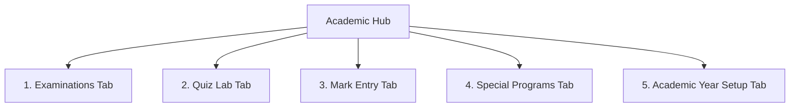

# GraphQL Integration Specification: Academic Hub

This document defines the GraphQL queries, mutations, variables, and type expectations required by the frontend **Academic Hub** module ([AcademicHubPage.tsx](file:///d:/Projects/School%20Luetic/letuic_schoolAdmin/src/features/academics/pages/AcademicHubPage.tsx)). It highlights active backend endpoints and outlines proposed specifications for currently mocked sections.

---

## 1. Overview of Academic Hub Tabs

The Academic Hub organizes five academic workflows under a unified tab navigation system:



---

## 2. Tab 1: Examinations & Tests

Manages exam cycles, syllabus details, schedules, and categories.

### 2.1 Get Exams List (`GetExams`)
Fetches all scheduled exams along with subject dates. Used in [ExaminationsPage.tsx](file:///d:/Projects/School%20Luetic/letuic_schoolAdmin/src/features/examinations/pages/ExaminationsPage.tsx).

#### GraphQL Query
```graphql
query GetExams {
  exams(page: 1, pageSize: 100) {
    items {
      id
      name
      type # Periodic Test (PT) | Unit Test | Quarterly | Half Yearly | Annual Exam | Mock Test
      dates {
        id
        subject
        syllabus
        date # ISO String date
        time # String representation, e.g. "09:00 AM"
      }
    }
  }
}
```

---

### 2.2 Create Exam Cycle (`CreateExam`)
Creates a new assessment cycle with date schedules in [AddExaminationPage.tsx](file:///d:/Projects/School%20Luetic/letuic_schoolAdmin/src/features/examinations/pages/AddExaminationPage.tsx).

#### GraphQL Mutation
```graphql
mutation CreateExam($input: CreateExamDto!) {
  createExam(createExamInput: $input) {
    id
    name
  }
}
```

#### Variables
```json
{
  "input": {
    "schoolId": "ee6a364d-a1d9-4ddb-958a-0d16913cfbad",
    "name": "Mid-Term Examination 2026",
    "type": "Half Yearly",
    "academicYearId": "1be319fa-7840-4ffa-a482-58f3dddd74f5",
    "dates": [
      {
        "date": "2026-10-12",
        "subject": "Mathematics",
        "syllabus": "Chapters 1 to 5: Trigonometry and Algebra",
        "time": "09:00 AM"
      }
    ]
  }
}
```

---
---

## 3. Tab 2: Quiz Lab (Requires Integration)

The Quiz Lab is currently **mocked** on the frontend. It features quiz lists, question libraries, and performance trackers.

### 3.1 Proposed GraphQL Schemas
To make this tab dynamic, the backend should support queries and mutations for `Quiz`:

```graphql
type Query {
  quizzes(page: Int, pageSize: Int, schoolId: String): PaginatedQuizzes!
  quiz(id: ID!): Quiz
}

type Mutation {
  createQuiz(input: CreateQuizInput!): Quiz!
  updateQuiz(id: ID!, input: UpdateQuizInput!): Quiz!
}

type Quiz {
  id: ID!
  title: String!
  subject: String!
  totalQuestions: Int!
  durationMinutes: Int!
  status: String! # DRAFT | ACTIVE | COMPLETED
  targetGrade: String!
  questions: [QuizQuestion!]
}

type QuizQuestion {
  id: ID!
  questionText: String!
  options: [String!]!
  correctOptionIndex: Int!
  points: Int!
}
```

---
---

## 4. Tab 3: Mark Entry

Manages class-level marks collection, grading, and bulk CSV ingestion in [MarksEntryPage.tsx](file:///d:/Projects/School%20Luetic/letuic_schoolAdmin/src/features/examinations/pages/MarksEntryPage.tsx).

### 4.1 Lookup Operations (Classes, Students, Marks)

The frontend fetches lists in parallel to display student names and populate current grade scores:
1. `classes`: Fetches classes list for dropdown.
2. `users(filter: { role: "STUDENT" })`: Gets the student registry for the active class.
3. `marks`: Pulls exam results to render in grid cells.

#### Queries
```graphql
query GetClasses($schoolId: String) {
  classes(filter: { schoolId: $schoolId }, page: 1, pageSize: 100) {
    items {
      id
      grade
      section
    }
  }
}

query GetClassStudents($classId: String, $schoolId: String) {
  users(filter: { role: "STUDENT", classId: $classId, schoolId: $schoolId, page: 1, pageSize: 200 }) {
    items {
      id
      name
      admissionNumber
      classId
    }
  }
}

query GetMarks {
  marks(page: 1, pageSize: 1000) {
    items {
      id
      studentId
      examId
      subject
      marksObtained
      totalMarks
    }
  }
}
```

---

### 4.2 Save Marks Mutations (`createMark` & `updateMark`)

Saves modified grid cells. Creates missing records or updates existing entries.

#### Mutations
```graphql
mutation CreateMark($input: CreateMarkDto!) {
  createMark(createExamInput: $input) {
    id
  }
}

mutation UpdateMark($id: ID!, $input: UpdateMarkDto!) {
  updateMark(id: $id, updateMarkInput: $input) {
    id
  }
}
```

#### Mutation Variables
```json
// Create Mark Variables
{
  "input": {
    "studentId": "eecea940-bf9b-4184-af11-f46fbac82ad3",
    "examId": "exam-9992-12",
    "subject": "Mathematics",
    "marks": 85.5,
    "totalMarks": 100
  }
}
```

---

### 4.3 Bulk CSV Ingestion Expectations

The **Bulk CSV Upload** action triggers an upload pipeline. Currently, it mimics file handling locally.
* **Format**: `.csv` formatted with header columns: `Admission Number`, `Student Name`, `Marks obtained for [Subject]`, etc.
* **Propose GraphQL API Integration**:
  ```graphql
  type Mutation {
    uploadMarksCsv(examId: ID!, classId: ID!, file: Upload!): BulkUploadResult!
  }
  ```

---
---

## 5. Tab 4: Special Programs (Requires Integration)

The Special Programs tab displays extracurricular registrations, events, and metrics. Currently **mocked**.

### 5.1 Proposed GraphQL Schemas
```graphql
type Query {
  specialPrograms(schoolId: String!): [SpecialProgram!]!
}

type SpecialProgram {
  id: ID!
  name: String!
  category: String! # SPORTS | ARTS | STEM | LEADERSHIP
  coordinatorName: String!
  enrolledStudentsCount: Int!
  status: String! # ACTIVE | SUSPENDED | COMPLETED
}
```

---
---

## 6. Tab 5: Academic Year Setup (Requires Integration)

Academic year setup and class rollover is currently **mocked** in [AcademicSetupPage.tsx](file:///d:/Projects/School%20Luetic/letuic_schoolAdmin/src/features/academic-setup/pages/AcademicSetupPage.tsx).

### 6.1 Proposed Multi-Step Rollover Schema

The setup wizard covers three steps:
1. **Calendar Cycle**: Sets start/end dates.
2. **Term Mapping**: Splits the year into Term 1, Term 2, etc.
3. **Rollover Options**: Selecting entities to carry forward (Students, Teachers, Timetable config, etc.).

#### Propose GraphQL Setup Mutation
```graphql
mutation InitiateAcademicYearRollover($input: AcademicYearRolloverInput!) {
  initiateAcademicYearRollover(input: $input) {
    newAcademicYearId
    status # SUCCESS | IN_PROGRESS | FAILED
    migratedStudentsCount
    migratedStaffCount
  }
}

input AcademicYearRolloverInput {
  schoolId: String!
  yearName: String!
  startDate: String!
  endDate: String!
  terms: [TermInput!]!
  rolloverStudents: Boolean!
  rolloverTeachers: Boolean!
  rolloverSubjects: Boolean!
  rolloverTimetable: Boolean!
}

input TermInput {
  name: String!
  startDate: String!
  endDate: String!
}
```
