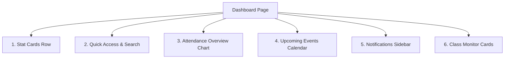

# GraphQL Integration Specification: Home Dashboard

This document outlines the GraphQL queries, variables, schemas, and type expectations required by the frontend **Home Dashboard** page and its sub-components. It specifies both the active GraphQL integrations and the data gaps (currently mock data) that require new backend APIs.

---

## 1. Overview of Dashboard Components

The Dashboard page ([DashboardPage.tsx](file:///d:/Projects/School%20Luetic/letuic_schoolAdmin/src/features/dashboard/pages/DashboardPage.tsx)) acts as a central hub, displaying school-wide statistics, a search tool for students, attendance overview charts, upcoming calendar events, administrative notifications, and a class performance monitor.



---

## 2. Active GraphQL Integrations (Currently Implemented)

### 2.1 Initial Dashboard Counts (`GetDashboardData`)

Fires on page mount to populate the total student count, teacher count, and classes drop-down directory cache.

#### GraphQL Query
```graphql
query GetDashboardData($schoolId: String) {
  students: users(filter: { role: "STUDENT", schoolId: $schoolId, page: 1, pageSize: 1 }) {
    total
  }
  teachers: users(filter: { role: "TEACHER", schoolId: $schoolId, page: 1, pageSize: 1 }) {
    total
  }
  classes(filter: { schoolId: $schoolId }, page: 1, pageSize: 100) {
    items {
      id
      grade
      section
    }
  }
}
```

---

### 2.2 Know Your Student Search (`SearchDashboardStudent`)

Queries student user accounts matching the search term.

#### GraphQL Query
```graphql
query SearchDashboardStudent($schoolId: String, $name: String!) {
  users(filter: { role: "STUDENT", schoolId: $schoolId, name: $name, page: 1, pageSize: 5 }) {
    items {
      id
      name
      role
      email
      mobileNo
      admissionNumber
      classId
      isActive
    }
  }
}
```

---

### 2.3 Student Aura Points Query (`GetStudentAura`)

Fetches the live aura points of a student to display in the Drawer component.

#### GraphQL Query
```graphql
query GetStudentAura($studentId: String!) {
  studentAuraPoints(studentId: $studentId) {
    totalPoints
  }
}
```

---

### 2.4 Class Monitor Student Fetch (`GetClassStudents`)

Triggered when clicking a Class Monitor card to pull the first student in that class and display their profile drawer.

#### GraphQL Query
```graphql
query GetClassStudents($classId: String!) {
  users(filter: { role: "STUDENT", classId: $classId, page: 1, pageSize: 1 }) {
    items {
      id
      name
      role
      email
      mobileNo
      admissionNumber
      classId
      isActive
    }
  }
}
```

---

### 2.5 Notifications Sidebar (`GetAlertNotifications`)

Renders recent admin/announcement logs in the right panel ([Alerts.tsx](file:///d:/Projects/School%20Luetic/letuic_schoolAdmin/src/features/dashboard/components/Alerts.tsx)).

#### GraphQL Query
```graphql
query GetAlertNotifications($page: Int, $pageSize: Int) {
  notifications(page: $page, pageSize: $pageSize) {
    items {
      id
      title
      content
      createdAt
    }
  }
}
```

---

### 2.6 Calendar & Events (`GetCalendarsWithEvents`)

Renders a consolidated list of upcoming events in the calendar panel ([ProgramsTable.tsx](file:///d:/Projects/School%20Luetic/letuic_schoolAdmin/src/features/dashboard/components/ProgramsTable.tsx)).

#### GraphQL Query
```graphql
query GetCalendarsWithEvents {
  calendars(page: 1, pageSize: 10) {
    items {
      id
      name
      events {
        id
        title
        description
        date
        type # HOLIDAY | EXAM | ACTIVITY | HALF_DAY | ANNUAL_DAY
      }
    }
  }
}
```

---
---

## 3. Data Gaps & Mocked Elements (Requires Backend Integration)

The following components display static mock data and require new backend endpoints to make them fully dynamic.

### 3.1 Today's Attendance Overview

The segmented arc ring and breakdown stats in [ParticipationOverview.tsx](file:///d:/Projects/School%20Luetic/letuic_schoolAdmin/src/features/dashboard/components/ParticipationOverview.tsx) are hardcoded:
* Total students: `1,240`
* Present: `1068` (`86%`)
* Absent: `124` (`10%`)
* Late: `48` (`4%`)

#### Propose GraphQL Query
```graphql
query GetTodayAttendanceStats($schoolId: String!) {
  todayAttendanceStats(schoolId: $schoolId) {
    totalStudents
    presentCount
    absentCount
    lateCount
    attendancePercentage
  }
}
```

---

### 3.2 Stat Cards Panel (Live Stats)

Two of the four cards in [DashboardPage.tsx](file:///d:/Projects/School%20Luetic/letuic_schoolAdmin/src/features/dashboard/pages/DashboardPage.tsx#L279-L308) display static values:
* **Attendance Today**: Hardcoded as `"86%"`. (Should tie into the attendance query above).
* **Pending Actions**: Hardcoded as `"07"` with trend `"3 urgent"`.

#### Proposed GraphQL Query extension
```graphql
query GetDashboardStatCards($schoolId: String!) {
  dashboardStatSummary(schoolId: $schoolId) {
    todayAttendanceRate
    pendingActionsCount
    urgentActionsCount
  }
}
```

---

### 3.3 Class Monitor Alerts

The class list under the Class Monitor row contains mocked anomaly warnings:
1. `11-C` (Teacher: Mr. Manoj P., Issue: Attendance Drop, Detail: -22% Morning, Score: 62%, Status: critical)
2. `9-D` (Teacher: Ms. Dhanya S., Issue: Grade Decline, Detail: Average Drop, Score: 76%, Status: warning)
3. `10-A` (Teacher: Dr. Lakshmi K., Issue: Absenteeism, Detail: Unusual spikes, Score: 68%, Status: warning)

#### Proposed GraphQL Query
```graphql
query GetClassMonitorAlerts($schoolId: String!) {
  classMonitorAlerts(schoolId: $schoolId) {
    items {
      classId
      grade
      section
      classTeacherName
      issueType # ATTENDANCE_DROP | GRADE_DECLINE | ABSENTEEISM
      issueDetails
      scorePercentage
      severityStatus # CRITICAL | WARNING
    }
  }
}
```

---

### 3.4 Student Drawer Overview Attributes

When search results pop up in the [StudentDrawer](file:///d:/Projects/School%20Luetic/letuic_schoolAdmin/src/features/students/components/StudentDrawer.tsx), several fields fallback to static values since they are not returned in the user query:
* `participation` (mocked as `75` or `62`)
* `attendanceRate` (mocked as `92` or `72`)
* `gpa` (mocked as `3.5` or `2.8`)
* `status` (mocked as `"Active"`, `"Inactive"`, or `"At Risk"`)

#### Propose GraphQL Query integration
Extend the search response or the drawer initialization to query a dedicated `StudentOverview` node:
```graphql
query GetStudentDrawerOverview($studentId: ID!) {
  studentOverview(id: $studentId) {
    participationRate
    attendanceRate
    gpa
    statusAlert
  }
}
```
